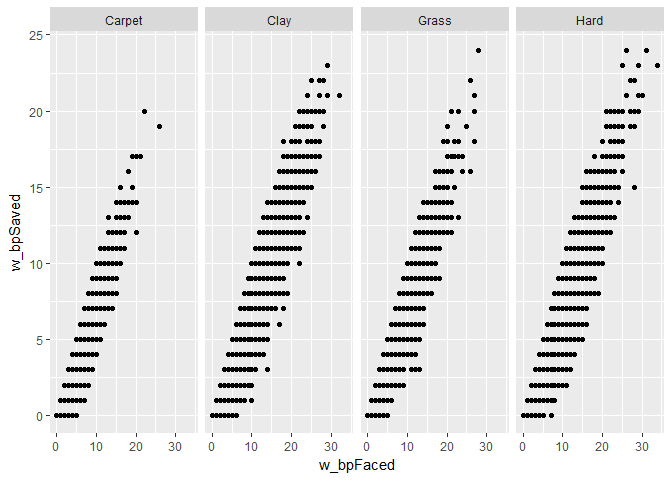
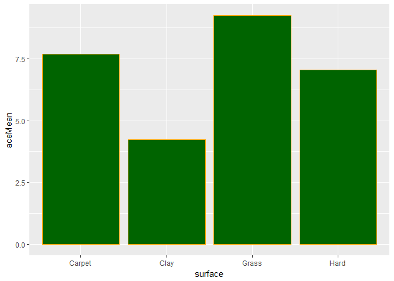

男子網球勝率因子分析
================

簡名浩、楊博翰分析議題背景
--------------------------

網球堪稱世界三大運動之一，也有紳士運動之稱，其起源於中世紀晚期的法國宮廷遊戲；而現代網球規則則是由19世紀一位英國少校所發明。 一場網球比賽大致由分、局及盤三要素組成，參與人數可以是2人或4人分為兩方，進行方式為雙方格網持拍相互將球回及過網，在允許球落地彈跳一次的前提下，首先令對方無法做出有效回擊球者便獲得 1分(point)，先得4分者得1局(game)，並且先得6局者得1盤(set)。現今ATP(國際男子職業網球協會)賽事為縮短比賽耗時，獲勝機制皆從五盤三勝改為三盤兩勝制。 在網球眾多賽事中，年度四大滿貫賽事是其中等級最高，也最被重視的比賽，其規模甚至超越四年一度的夏季奧林匹克運動會網球項目，即便是平常不接觸ATP賽事的觀眾都能因為大滿貫賽事而出現"一日球迷"的情況，它們分別為：澳洲網球公開賽、法國網球公開賽、溫布頓網球錦標賽以及美國網球公開賽，其中歷史最悠久，被視為網球最高榮譽賽事者為溫布頓網球錦標賽。即便溫布頓網球錦標賽在1877年即舉辦，但當時的大滿貫賽事不允許職業選手參賽，直到1968年始成為公開賽事，因此世人將此後的時期稱為"網球公開化年代"，也是今次我們主要分析的時期(1968~2017)。 在早期，大滿貫比賽皆效仿溫布頓在草地上舉行，隨後逐漸發展出自己的特色。現在按場地材質可將場地分為草地、紅土、硬地及室內地毯等。

分析動機
--------

此次分析主要分析勝率與球員其他數據之間的關係。網球是屬於紳士的運動，不如其他主流球類運動如足球、橄欖球或籃球等需要肢體接觸，除了顯得有些野蠻之外，也時常能發生衝突爭議。網球的競爭中，雙方揖讓而升，網子隔開雙方不會有衝突的發生，純粹是力與智的較量，堪稱最高尚的運動之一，深得朕心，是以以此為題分析，一方面對於網球有一定的背景知識了解，另一方面分析起來也比較開心，不會只為滿足老師虛應故事。

使用資料
--------

GitHub Jeffsackmann repository：tennis\_atp： <https://github.com/JeffSackmann/tennis_atp> 使用資料： 1.公開化年代後歷年比賽資料：atp\_matches\_year.csv 2.歷年所有職業球員名單：atp\_players.csv 3.公開化年代後球員排名波動：atp\_rankings\_decades.csv

載入使用資料們

``` r
#這是R Code Chunk
library(readr)
atp_matches_1968 <- read_csv("D:/atp_datas/atp_matches_1968.csv")
```

    ## Parsed with column specification:
    ## cols(
    ##   .default = col_character(),
    ##   draw_size = col_integer(),
    ##   tourney_date = col_integer(),
    ##   winner_id = col_integer(),
    ##   winner_seed = col_integer(),
    ##   winner_ht = col_integer(),
    ##   winner_age = col_double(),
    ##   loser_id = col_integer(),
    ##   loser_seed = col_integer(),
    ##   loser_ht = col_integer(),
    ##   loser_age = col_double(),
    ##   best_of = col_integer()
    ## )

    ## See spec(...) for full column specifications.

``` r
atp_matches_1969 <- read_csv("D:/atp_datas/atp_matches_1969.csv")
```

    ## Parsed with column specification:
    ## cols(
    ##   .default = col_character(),
    ##   draw_size = col_integer(),
    ##   tourney_date = col_integer(),
    ##   winner_id = col_integer(),
    ##   winner_seed = col_integer(),
    ##   winner_ht = col_integer(),
    ##   winner_age = col_double(),
    ##   loser_id = col_integer(),
    ##   loser_seed = col_integer(),
    ##   loser_ht = col_integer(),
    ##   loser_age = col_double(),
    ##   best_of = col_integer()
    ## )
    ## See spec(...) for full column specifications.

``` r
atp_matches_1970 <- read_csv("D:/atp_datas/atp_matches_1970.csv")
```

    ## Parsed with column specification:
    ## cols(
    ##   .default = col_character(),
    ##   draw_size = col_integer(),
    ##   tourney_date = col_integer(),
    ##   winner_id = col_integer(),
    ##   winner_seed = col_integer(),
    ##   winner_ht = col_integer(),
    ##   winner_age = col_double(),
    ##   loser_id = col_integer(),
    ##   loser_seed = col_integer(),
    ##   loser_ht = col_integer(),
    ##   loser_age = col_double(),
    ##   best_of = col_integer()
    ## )
    ## See spec(...) for full column specifications.

``` r
atp_matches_1971 <- read_csv("D:/atp_datas/atp_matches_1971.csv")
```

    ## Parsed with column specification:
    ## cols(
    ##   .default = col_character(),
    ##   draw_size = col_integer(),
    ##   tourney_date = col_integer(),
    ##   winner_id = col_integer(),
    ##   winner_seed = col_integer(),
    ##   winner_ht = col_integer(),
    ##   winner_age = col_double(),
    ##   loser_id = col_integer(),
    ##   loser_seed = col_integer(),
    ##   loser_ht = col_integer(),
    ##   loser_age = col_double(),
    ##   best_of = col_integer()
    ## )
    ## See spec(...) for full column specifications.

``` r
atp_matches_1972 <- read_csv("D:/atp_datas/atp_matches_1972.csv")
```

    ## Parsed with column specification:
    ## cols(
    ##   .default = col_character(),
    ##   draw_size = col_integer(),
    ##   tourney_date = col_integer(),
    ##   winner_id = col_integer(),
    ##   winner_seed = col_integer(),
    ##   winner_ht = col_integer(),
    ##   winner_age = col_double(),
    ##   loser_id = col_integer(),
    ##   loser_seed = col_integer(),
    ##   loser_ht = col_integer(),
    ##   loser_age = col_double(),
    ##   best_of = col_integer()
    ## )
    ## See spec(...) for full column specifications.

``` r
atp_matches_1973 <- read_csv("D:/atp_datas/atp_matches_1973.csv")
```

    ## Parsed with column specification:
    ## cols(
    ##   .default = col_character(),
    ##   draw_size = col_integer(),
    ##   tourney_date = col_integer(),
    ##   winner_id = col_integer(),
    ##   winner_seed = col_integer(),
    ##   winner_ht = col_integer(),
    ##   winner_age = col_double(),
    ##   winner_rank = col_integer(),
    ##   winner_rank_points = col_integer(),
    ##   loser_id = col_integer(),
    ##   loser_seed = col_integer(),
    ##   loser_ht = col_integer(),
    ##   loser_age = col_double(),
    ##   loser_rank = col_integer(),
    ##   loser_rank_points = col_integer(),
    ##   best_of = col_integer()
    ## )
    ## See spec(...) for full column specifications.

``` r
atp_matches_1974 <- read_csv("D:/atp_datas/atp_matches_1974.csv")
```

    ## Parsed with column specification:
    ## cols(
    ##   .default = col_character(),
    ##   draw_size = col_integer(),
    ##   tourney_date = col_integer(),
    ##   winner_id = col_integer(),
    ##   winner_seed = col_integer(),
    ##   winner_ht = col_integer(),
    ##   winner_age = col_double(),
    ##   winner_rank = col_integer(),
    ##   winner_rank_points = col_integer(),
    ##   loser_id = col_integer(),
    ##   loser_seed = col_integer(),
    ##   loser_ht = col_integer(),
    ##   loser_age = col_double(),
    ##   loser_rank = col_integer(),
    ##   loser_rank_points = col_integer(),
    ##   best_of = col_integer()
    ## )
    ## See spec(...) for full column specifications.

``` r
atp_matches_1975 <- read_csv("D:/atp_datas/atp_matches_1975.csv")
```

    ## Parsed with column specification:
    ## cols(
    ##   .default = col_character(),
    ##   draw_size = col_integer(),
    ##   tourney_date = col_integer(),
    ##   winner_id = col_integer(),
    ##   winner_seed = col_integer(),
    ##   winner_ht = col_integer(),
    ##   winner_age = col_double(),
    ##   winner_rank = col_integer(),
    ##   winner_rank_points = col_integer(),
    ##   loser_id = col_integer(),
    ##   loser_seed = col_integer(),
    ##   loser_ht = col_integer(),
    ##   loser_age = col_double(),
    ##   loser_rank = col_integer(),
    ##   loser_rank_points = col_integer(),
    ##   best_of = col_integer()
    ## )
    ## See spec(...) for full column specifications.

``` r
atp_matches_1976 <- read_csv("D:/atp_datas/atp_matches_1976.csv")
```

    ## Parsed with column specification:
    ## cols(
    ##   .default = col_character(),
    ##   draw_size = col_integer(),
    ##   tourney_date = col_integer(),
    ##   winner_id = col_integer(),
    ##   winner_seed = col_integer(),
    ##   winner_ht = col_integer(),
    ##   winner_age = col_double(),
    ##   winner_rank = col_integer(),
    ##   winner_rank_points = col_integer(),
    ##   loser_id = col_integer(),
    ##   loser_seed = col_integer(),
    ##   loser_ht = col_integer(),
    ##   loser_age = col_double(),
    ##   loser_rank = col_integer(),
    ##   loser_rank_points = col_integer(),
    ##   best_of = col_integer()
    ## )
    ## See spec(...) for full column specifications.

``` r
atp_matches_1977 <- read_csv("D:/atp_datas/atp_matches_1977.csv")
```

    ## Parsed with column specification:
    ## cols(
    ##   .default = col_character(),
    ##   draw_size = col_integer(),
    ##   tourney_date = col_integer(),
    ##   winner_id = col_integer(),
    ##   winner_seed = col_integer(),
    ##   winner_ht = col_integer(),
    ##   winner_age = col_double(),
    ##   winner_rank = col_integer(),
    ##   winner_rank_points = col_integer(),
    ##   loser_id = col_integer(),
    ##   loser_seed = col_integer(),
    ##   loser_ht = col_integer(),
    ##   loser_age = col_double(),
    ##   loser_rank = col_integer(),
    ##   loser_rank_points = col_integer(),
    ##   best_of = col_integer()
    ## )
    ## See spec(...) for full column specifications.

``` r
atp_matches_1978 <- read_csv("D:/atp_datas/atp_matches_1978.csv")
```

    ## Parsed with column specification:
    ## cols(
    ##   .default = col_character(),
    ##   draw_size = col_integer(),
    ##   tourney_date = col_integer(),
    ##   winner_id = col_integer(),
    ##   winner_seed = col_integer(),
    ##   winner_ht = col_integer(),
    ##   winner_age = col_double(),
    ##   winner_rank = col_integer(),
    ##   winner_rank_points = col_integer(),
    ##   loser_id = col_integer(),
    ##   loser_seed = col_integer(),
    ##   loser_ht = col_integer(),
    ##   loser_age = col_double(),
    ##   loser_rank = col_integer(),
    ##   loser_rank_points = col_integer(),
    ##   best_of = col_integer()
    ## )
    ## See spec(...) for full column specifications.

``` r
atp_matches_1979 <- read_csv("D:/atp_datas/atp_matches_1979.csv")
```

    ## Parsed with column specification:
    ## cols(
    ##   .default = col_character(),
    ##   draw_size = col_integer(),
    ##   tourney_date = col_integer(),
    ##   winner_id = col_integer(),
    ##   winner_seed = col_integer(),
    ##   winner_ht = col_integer(),
    ##   winner_age = col_double(),
    ##   winner_rank = col_integer(),
    ##   winner_rank_points = col_integer(),
    ##   loser_id = col_integer(),
    ##   loser_seed = col_integer(),
    ##   loser_ht = col_integer(),
    ##   loser_age = col_double(),
    ##   loser_rank = col_integer(),
    ##   loser_rank_points = col_integer(),
    ##   best_of = col_integer()
    ## )
    ## See spec(...) for full column specifications.

``` r
atp_matches_1980 <- read_csv("D:/atp_datas/atp_matches_1980.csv")
```

    ## Parsed with column specification:
    ## cols(
    ##   .default = col_character(),
    ##   draw_size = col_integer(),
    ##   tourney_date = col_integer(),
    ##   winner_id = col_integer(),
    ##   winner_seed = col_integer(),
    ##   winner_ht = col_integer(),
    ##   winner_age = col_double(),
    ##   winner_rank = col_integer(),
    ##   winner_rank_points = col_integer(),
    ##   loser_id = col_integer(),
    ##   loser_seed = col_integer(),
    ##   loser_ht = col_integer(),
    ##   loser_age = col_double(),
    ##   loser_rank = col_integer(),
    ##   loser_rank_points = col_integer(),
    ##   best_of = col_integer()
    ## )
    ## See spec(...) for full column specifications.

``` r
atp_matches_1981 <- read_csv("D:/atp_datas/atp_matches_1981.csv")
```

    ## Parsed with column specification:
    ## cols(
    ##   .default = col_character(),
    ##   draw_size = col_integer(),
    ##   tourney_date = col_integer(),
    ##   winner_id = col_integer(),
    ##   winner_seed = col_integer(),
    ##   winner_ht = col_integer(),
    ##   winner_age = col_double(),
    ##   winner_rank = col_integer(),
    ##   winner_rank_points = col_integer(),
    ##   loser_id = col_integer(),
    ##   loser_seed = col_integer(),
    ##   loser_ht = col_integer(),
    ##   loser_age = col_double(),
    ##   loser_rank = col_integer(),
    ##   loser_rank_points = col_integer(),
    ##   best_of = col_integer()
    ## )
    ## See spec(...) for full column specifications.

``` r
atp_matches_1982 <- read_csv("D:/atp_datas/atp_matches_1982.csv")
```

    ## Parsed with column specification:
    ## cols(
    ##   .default = col_character(),
    ##   draw_size = col_integer(),
    ##   tourney_date = col_integer(),
    ##   winner_id = col_integer(),
    ##   winner_seed = col_integer(),
    ##   winner_ht = col_integer(),
    ##   winner_age = col_double(),
    ##   winner_rank = col_integer(),
    ##   winner_rank_points = col_integer(),
    ##   loser_id = col_integer(),
    ##   loser_seed = col_integer(),
    ##   loser_ht = col_integer(),
    ##   loser_age = col_double(),
    ##   loser_rank = col_integer(),
    ##   loser_rank_points = col_integer(),
    ##   best_of = col_integer()
    ## )
    ## See spec(...) for full column specifications.

``` r
atp_matches_1983 <- read_csv("D:/atp_datas/atp_matches_1983.csv")
```

    ## Parsed with column specification:
    ## cols(
    ##   .default = col_character(),
    ##   draw_size = col_integer(),
    ##   tourney_date = col_integer(),
    ##   winner_id = col_integer(),
    ##   winner_seed = col_integer(),
    ##   winner_ht = col_integer(),
    ##   winner_age = col_double(),
    ##   winner_rank = col_integer(),
    ##   winner_rank_points = col_integer(),
    ##   loser_id = col_integer(),
    ##   loser_seed = col_integer(),
    ##   loser_ht = col_integer(),
    ##   loser_age = col_double(),
    ##   loser_rank = col_integer(),
    ##   loser_rank_points = col_integer(),
    ##   best_of = col_integer()
    ## )
    ## See spec(...) for full column specifications.

``` r
atp_matches_1984 <- read_csv("D:/atp_datas/atp_matches_1984.csv")
```

    ## Parsed with column specification:
    ## cols(
    ##   .default = col_character(),
    ##   draw_size = col_integer(),
    ##   tourney_date = col_integer(),
    ##   winner_id = col_integer(),
    ##   winner_seed = col_integer(),
    ##   winner_ht = col_integer(),
    ##   winner_age = col_double(),
    ##   winner_rank = col_integer(),
    ##   winner_rank_points = col_integer(),
    ##   loser_id = col_integer(),
    ##   loser_seed = col_integer(),
    ##   loser_ht = col_integer(),
    ##   loser_age = col_double(),
    ##   loser_rank = col_integer(),
    ##   loser_rank_points = col_integer(),
    ##   best_of = col_integer()
    ## )
    ## See spec(...) for full column specifications.

``` r
atp_matches_1985 <- read_csv("D:/atp_datas/atp_matches_1985.csv")
```

    ## Parsed with column specification:
    ## cols(
    ##   .default = col_character(),
    ##   draw_size = col_integer(),
    ##   tourney_date = col_integer(),
    ##   winner_id = col_integer(),
    ##   winner_seed = col_integer(),
    ##   winner_ht = col_integer(),
    ##   winner_age = col_double(),
    ##   winner_rank = col_integer(),
    ##   winner_rank_points = col_integer(),
    ##   loser_id = col_integer(),
    ##   loser_seed = col_integer(),
    ##   loser_ht = col_integer(),
    ##   loser_age = col_double(),
    ##   loser_rank = col_integer(),
    ##   loser_rank_points = col_integer(),
    ##   best_of = col_integer()
    ## )
    ## See spec(...) for full column specifications.

``` r
atp_matches_1986 <- read_csv("D:/atp_datas/atp_matches_1986.csv")
```

    ## Parsed with column specification:
    ## cols(
    ##   .default = col_character(),
    ##   draw_size = col_integer(),
    ##   tourney_date = col_integer(),
    ##   winner_id = col_integer(),
    ##   winner_seed = col_integer(),
    ##   winner_ht = col_integer(),
    ##   winner_age = col_double(),
    ##   winner_rank = col_integer(),
    ##   winner_rank_points = col_integer(),
    ##   loser_id = col_integer(),
    ##   loser_seed = col_integer(),
    ##   loser_ht = col_integer(),
    ##   loser_age = col_double(),
    ##   loser_rank = col_integer(),
    ##   loser_rank_points = col_integer(),
    ##   best_of = col_integer()
    ## )
    ## See spec(...) for full column specifications.

``` r
atp_matches_1987 <- read_csv("D:/atp_datas/atp_matches_1987.csv")
```

    ## Parsed with column specification:
    ## cols(
    ##   .default = col_character(),
    ##   draw_size = col_integer(),
    ##   tourney_date = col_integer(),
    ##   winner_id = col_integer(),
    ##   winner_seed = col_integer(),
    ##   winner_ht = col_integer(),
    ##   winner_age = col_double(),
    ##   winner_rank = col_integer(),
    ##   winner_rank_points = col_integer(),
    ##   loser_id = col_integer(),
    ##   loser_seed = col_integer(),
    ##   loser_ht = col_integer(),
    ##   loser_age = col_double(),
    ##   loser_rank = col_integer(),
    ##   loser_rank_points = col_integer(),
    ##   best_of = col_integer()
    ## )
    ## See spec(...) for full column specifications.

``` r
atp_matches_1988 <- read_csv("D:/atp_datas/atp_matches_1988.csv")
```

    ## Parsed with column specification:
    ## cols(
    ##   .default = col_character(),
    ##   draw_size = col_integer(),
    ##   tourney_date = col_integer(),
    ##   winner_id = col_integer(),
    ##   winner_seed = col_integer(),
    ##   winner_ht = col_integer(),
    ##   winner_age = col_double(),
    ##   winner_rank = col_integer(),
    ##   winner_rank_points = col_integer(),
    ##   loser_id = col_integer(),
    ##   loser_seed = col_integer(),
    ##   loser_ht = col_integer(),
    ##   loser_age = col_double(),
    ##   loser_rank = col_integer(),
    ##   loser_rank_points = col_integer(),
    ##   best_of = col_integer()
    ## )
    ## See spec(...) for full column specifications.

``` r
atp_matches_1989 <- read_csv("D:/atp_datas/atp_matches_1989.csv")
```

    ## Parsed with column specification:
    ## cols(
    ##   .default = col_character(),
    ##   draw_size = col_integer(),
    ##   tourney_date = col_integer(),
    ##   winner_id = col_integer(),
    ##   winner_seed = col_integer(),
    ##   winner_ht = col_integer(),
    ##   winner_age = col_double(),
    ##   winner_rank = col_integer(),
    ##   winner_rank_points = col_integer(),
    ##   loser_id = col_integer(),
    ##   loser_seed = col_integer(),
    ##   loser_ht = col_integer(),
    ##   loser_age = col_double(),
    ##   loser_rank = col_integer(),
    ##   loser_rank_points = col_integer(),
    ##   best_of = col_integer()
    ## )
    ## See spec(...) for full column specifications.

``` r
atp_matches_1990 <- read_csv("D:/atp_datas/atp_matches_1990.csv")
```

    ## Parsed with column specification:
    ## cols(
    ##   .default = col_character(),
    ##   draw_size = col_integer(),
    ##   tourney_date = col_integer(),
    ##   winner_id = col_integer(),
    ##   winner_seed = col_integer(),
    ##   winner_ht = col_integer(),
    ##   winner_age = col_double(),
    ##   winner_rank = col_integer(),
    ##   winner_rank_points = col_integer(),
    ##   loser_id = col_integer(),
    ##   loser_seed = col_integer(),
    ##   loser_ht = col_integer(),
    ##   loser_age = col_double(),
    ##   loser_rank = col_integer(),
    ##   loser_rank_points = col_integer(),
    ##   best_of = col_integer()
    ## )
    ## See spec(...) for full column specifications.

``` r
atp_matches_1991 <- read_csv("D:/atp_datas/atp_matches_1991.csv")
```

    ## Parsed with column specification:
    ## cols(
    ##   .default = col_integer(),
    ##   tourney_id = col_character(),
    ##   tourney_name = col_character(),
    ##   surface = col_character(),
    ##   tourney_level = col_character(),
    ##   match_num = col_character(),
    ##   winner_entry = col_character(),
    ##   winner_name = col_character(),
    ##   winner_hand = col_character(),
    ##   winner_ioc = col_character(),
    ##   winner_age = col_double(),
    ##   loser_entry = col_character(),
    ##   loser_name = col_character(),
    ##   loser_hand = col_character(),
    ##   loser_ioc = col_character(),
    ##   loser_age = col_double(),
    ##   score = col_character(),
    ##   round = col_character()
    ## )
    ## See spec(...) for full column specifications.

``` r
atp_matches_1992 <- read_csv("D:/atp_datas/atp_matches_1992.csv")
```

    ## Parsed with column specification:
    ## cols(
    ##   .default = col_integer(),
    ##   tourney_id = col_character(),
    ##   tourney_name = col_character(),
    ##   surface = col_character(),
    ##   tourney_level = col_character(),
    ##   match_num = col_character(),
    ##   winner_entry = col_character(),
    ##   winner_name = col_character(),
    ##   winner_hand = col_character(),
    ##   winner_ioc = col_character(),
    ##   winner_age = col_double(),
    ##   loser_entry = col_character(),
    ##   loser_name = col_character(),
    ##   loser_hand = col_character(),
    ##   loser_ioc = col_character(),
    ##   loser_age = col_double(),
    ##   score = col_character(),
    ##   round = col_character()
    ## )
    ## See spec(...) for full column specifications.

``` r
atp_matches_1993 <- read_csv("D:/atp_datas/atp_matches_1993.csv")
```

    ## Parsed with column specification:
    ## cols(
    ##   .default = col_integer(),
    ##   tourney_id = col_character(),
    ##   tourney_name = col_character(),
    ##   surface = col_character(),
    ##   tourney_level = col_character(),
    ##   match_num = col_character(),
    ##   winner_entry = col_character(),
    ##   winner_name = col_character(),
    ##   winner_hand = col_character(),
    ##   winner_ioc = col_character(),
    ##   winner_age = col_double(),
    ##   loser_entry = col_character(),
    ##   loser_name = col_character(),
    ##   loser_hand = col_character(),
    ##   loser_ioc = col_character(),
    ##   loser_age = col_double(),
    ##   score = col_character(),
    ##   round = col_character()
    ## )
    ## See spec(...) for full column specifications.

``` r
atp_matches_1994 <- read_csv("D:/atp_datas/atp_matches_1994.csv")
```

    ## Parsed with column specification:
    ## cols(
    ##   .default = col_integer(),
    ##   tourney_id = col_character(),
    ##   tourney_name = col_character(),
    ##   surface = col_character(),
    ##   tourney_level = col_character(),
    ##   match_num = col_character(),
    ##   winner_entry = col_character(),
    ##   winner_name = col_character(),
    ##   winner_hand = col_character(),
    ##   winner_ioc = col_character(),
    ##   winner_age = col_double(),
    ##   loser_entry = col_character(),
    ##   loser_name = col_character(),
    ##   loser_hand = col_character(),
    ##   loser_ioc = col_character(),
    ##   loser_age = col_double(),
    ##   score = col_character(),
    ##   round = col_character()
    ## )
    ## See spec(...) for full column specifications.

``` r
atp_matches_1995 <- read_csv("D:/atp_datas/atp_matches_1995.csv")
```

    ## Parsed with column specification:
    ## cols(
    ##   .default = col_integer(),
    ##   tourney_id = col_character(),
    ##   tourney_name = col_character(),
    ##   surface = col_character(),
    ##   tourney_level = col_character(),
    ##   match_num = col_character(),
    ##   winner_entry = col_character(),
    ##   winner_name = col_character(),
    ##   winner_hand = col_character(),
    ##   winner_ioc = col_character(),
    ##   winner_age = col_double(),
    ##   loser_entry = col_character(),
    ##   loser_name = col_character(),
    ##   loser_hand = col_character(),
    ##   loser_ioc = col_character(),
    ##   loser_age = col_double(),
    ##   score = col_character(),
    ##   round = col_character()
    ## )
    ## See spec(...) for full column specifications.

``` r
atp_matches_1996 <- read_csv("D:/atp_datas/atp_matches_1996.csv")
```

    ## Parsed with column specification:
    ## cols(
    ##   .default = col_integer(),
    ##   tourney_id = col_character(),
    ##   tourney_name = col_character(),
    ##   surface = col_character(),
    ##   tourney_level = col_character(),
    ##   match_num = col_character(),
    ##   winner_entry = col_character(),
    ##   winner_name = col_character(),
    ##   winner_hand = col_character(),
    ##   winner_ioc = col_character(),
    ##   winner_age = col_double(),
    ##   loser_entry = col_character(),
    ##   loser_name = col_character(),
    ##   loser_hand = col_character(),
    ##   loser_ioc = col_character(),
    ##   loser_age = col_double(),
    ##   score = col_character(),
    ##   round = col_character()
    ## )
    ## See spec(...) for full column specifications.

``` r
atp_matches_1997 <- read_csv("D:/atp_datas/atp_matches_1997.csv")
```

    ## Parsed with column specification:
    ## cols(
    ##   .default = col_integer(),
    ##   tourney_id = col_character(),
    ##   tourney_name = col_character(),
    ##   surface = col_character(),
    ##   tourney_level = col_character(),
    ##   match_num = col_character(),
    ##   winner_entry = col_character(),
    ##   winner_name = col_character(),
    ##   winner_hand = col_character(),
    ##   winner_ioc = col_character(),
    ##   winner_age = col_double(),
    ##   loser_entry = col_character(),
    ##   loser_name = col_character(),
    ##   loser_hand = col_character(),
    ##   loser_ioc = col_character(),
    ##   loser_age = col_double(),
    ##   score = col_character(),
    ##   round = col_character()
    ## )
    ## See spec(...) for full column specifications.

``` r
atp_matches_1998 <- read_csv("D:/atp_datas/atp_matches_1998.csv")
```

    ## Parsed with column specification:
    ## cols(
    ##   .default = col_integer(),
    ##   tourney_id = col_character(),
    ##   tourney_name = col_character(),
    ##   surface = col_character(),
    ##   tourney_level = col_character(),
    ##   match_num = col_character(),
    ##   winner_entry = col_character(),
    ##   winner_name = col_character(),
    ##   winner_hand = col_character(),
    ##   winner_ioc = col_character(),
    ##   winner_age = col_double(),
    ##   loser_entry = col_character(),
    ##   loser_name = col_character(),
    ##   loser_hand = col_character(),
    ##   loser_ioc = col_character(),
    ##   loser_age = col_double(),
    ##   score = col_character(),
    ##   round = col_character()
    ## )
    ## See spec(...) for full column specifications.

``` r
atp_matches_1999 <- read_csv("D:/atp_datas/atp_matches_1999.csv")
```

    ## Parsed with column specification:
    ## cols(
    ##   .default = col_integer(),
    ##   tourney_id = col_character(),
    ##   tourney_name = col_character(),
    ##   surface = col_character(),
    ##   tourney_level = col_character(),
    ##   match_num = col_character(),
    ##   winner_entry = col_character(),
    ##   winner_name = col_character(),
    ##   winner_hand = col_character(),
    ##   winner_ioc = col_character(),
    ##   winner_age = col_double(),
    ##   loser_entry = col_character(),
    ##   loser_name = col_character(),
    ##   loser_hand = col_character(),
    ##   loser_ioc = col_character(),
    ##   loser_age = col_double(),
    ##   score = col_character(),
    ##   round = col_character()
    ## )
    ## See spec(...) for full column specifications.

``` r
atp_matches_2000 <- read_csv("D:/atp_datas/atp_matches_2000.csv")
```

    ## Parsed with column specification:
    ## cols(
    ##   .default = col_integer(),
    ##   tourney_id = col_character(),
    ##   tourney_name = col_character(),
    ##   surface = col_character(),
    ##   tourney_level = col_character(),
    ##   match_num = col_character(),
    ##   winner_entry = col_character(),
    ##   winner_name = col_character(),
    ##   winner_hand = col_character(),
    ##   winner_ioc = col_character(),
    ##   winner_age = col_double(),
    ##   loser_entry = col_character(),
    ##   loser_name = col_character(),
    ##   loser_hand = col_character(),
    ##   loser_ioc = col_character(),
    ##   loser_age = col_double(),
    ##   score = col_character(),
    ##   round = col_character()
    ## )
    ## See spec(...) for full column specifications.

``` r
atp_matches_2001 <- read_csv("D:/atp_datas/atp_matches_2001.csv")
```

    ## Parsed with column specification:
    ## cols(
    ##   .default = col_integer(),
    ##   tourney_id = col_character(),
    ##   tourney_name = col_character(),
    ##   surface = col_character(),
    ##   tourney_level = col_character(),
    ##   match_num = col_character(),
    ##   winner_entry = col_character(),
    ##   winner_name = col_character(),
    ##   winner_hand = col_character(),
    ##   winner_ioc = col_character(),
    ##   winner_age = col_double(),
    ##   loser_entry = col_character(),
    ##   loser_name = col_character(),
    ##   loser_hand = col_character(),
    ##   loser_ioc = col_character(),
    ##   loser_age = col_double(),
    ##   score = col_character(),
    ##   round = col_character()
    ## )
    ## See spec(...) for full column specifications.

``` r
atp_matches_2002 <- read_csv("D:/atp_datas/atp_matches_2002.csv")
```

    ## Parsed with column specification:
    ## cols(
    ##   .default = col_integer(),
    ##   tourney_id = col_character(),
    ##   tourney_name = col_character(),
    ##   surface = col_character(),
    ##   tourney_level = col_character(),
    ##   match_num = col_character(),
    ##   winner_entry = col_character(),
    ##   winner_name = col_character(),
    ##   winner_hand = col_character(),
    ##   winner_ioc = col_character(),
    ##   winner_age = col_double(),
    ##   loser_entry = col_character(),
    ##   loser_name = col_character(),
    ##   loser_hand = col_character(),
    ##   loser_ioc = col_character(),
    ##   loser_age = col_double(),
    ##   score = col_character(),
    ##   round = col_character()
    ## )
    ## See spec(...) for full column specifications.

``` r
atp_matches_2003 <- read_csv("D:/atp_datas/atp_matches_2003.csv")
```

    ## Parsed with column specification:
    ## cols(
    ##   .default = col_integer(),
    ##   tourney_id = col_character(),
    ##   tourney_name = col_character(),
    ##   surface = col_character(),
    ##   tourney_level = col_character(),
    ##   match_num = col_character(),
    ##   winner_entry = col_character(),
    ##   winner_name = col_character(),
    ##   winner_hand = col_character(),
    ##   winner_ioc = col_character(),
    ##   winner_age = col_double(),
    ##   loser_entry = col_character(),
    ##   loser_name = col_character(),
    ##   loser_hand = col_character(),
    ##   loser_ioc = col_character(),
    ##   loser_age = col_double(),
    ##   score = col_character(),
    ##   round = col_character()
    ## )
    ## See spec(...) for full column specifications.

``` r
atp_matches_2004 <- read_csv("D:/atp_datas/atp_matches_2004.csv")
```

    ## Parsed with column specification:
    ## cols(
    ##   .default = col_integer(),
    ##   tourney_id = col_character(),
    ##   tourney_name = col_character(),
    ##   surface = col_character(),
    ##   tourney_level = col_character(),
    ##   match_num = col_character(),
    ##   winner_entry = col_character(),
    ##   winner_name = col_character(),
    ##   winner_hand = col_character(),
    ##   winner_ioc = col_character(),
    ##   winner_age = col_double(),
    ##   loser_entry = col_character(),
    ##   loser_name = col_character(),
    ##   loser_hand = col_character(),
    ##   loser_ioc = col_character(),
    ##   loser_age = col_double(),
    ##   score = col_character(),
    ##   round = col_character()
    ## )
    ## See spec(...) for full column specifications.

``` r
atp_matches_2005 <- read_csv("D:/atp_datas/atp_matches_2005.csv")
```

    ## Parsed with column specification:
    ## cols(
    ##   .default = col_integer(),
    ##   tourney_id = col_character(),
    ##   tourney_name = col_character(),
    ##   surface = col_character(),
    ##   tourney_level = col_character(),
    ##   match_num = col_character(),
    ##   winner_entry = col_character(),
    ##   winner_name = col_character(),
    ##   winner_hand = col_character(),
    ##   winner_ioc = col_character(),
    ##   winner_age = col_double(),
    ##   loser_entry = col_character(),
    ##   loser_name = col_character(),
    ##   loser_hand = col_character(),
    ##   loser_ioc = col_character(),
    ##   loser_age = col_double(),
    ##   score = col_character(),
    ##   round = col_character()
    ## )
    ## See spec(...) for full column specifications.

``` r
atp_matches_2006 <- read_csv("D:/atp_datas/atp_matches_2006.csv")
```

    ## Parsed with column specification:
    ## cols(
    ##   .default = col_integer(),
    ##   tourney_id = col_character(),
    ##   tourney_name = col_character(),
    ##   surface = col_character(),
    ##   tourney_level = col_character(),
    ##   match_num = col_character(),
    ##   winner_entry = col_character(),
    ##   winner_name = col_character(),
    ##   winner_hand = col_character(),
    ##   winner_ioc = col_character(),
    ##   winner_age = col_double(),
    ##   loser_entry = col_character(),
    ##   loser_name = col_character(),
    ##   loser_hand = col_character(),
    ##   loser_ioc = col_character(),
    ##   loser_age = col_double(),
    ##   score = col_character(),
    ##   round = col_character()
    ## )
    ## See spec(...) for full column specifications.

``` r
atp_matches_2007 <- read_csv("D:/atp_datas/atp_matches_2007.csv")
```

    ## Parsed with column specification:
    ## cols(
    ##   .default = col_integer(),
    ##   tourney_id = col_character(),
    ##   tourney_name = col_character(),
    ##   surface = col_character(),
    ##   tourney_level = col_character(),
    ##   match_num = col_character(),
    ##   winner_entry = col_character(),
    ##   winner_name = col_character(),
    ##   winner_hand = col_character(),
    ##   winner_ioc = col_character(),
    ##   winner_age = col_double(),
    ##   loser_entry = col_character(),
    ##   loser_name = col_character(),
    ##   loser_hand = col_character(),
    ##   loser_ioc = col_character(),
    ##   loser_age = col_double(),
    ##   score = col_character(),
    ##   round = col_character()
    ## )
    ## See spec(...) for full column specifications.

``` r
atp_matches_2008 <- read_csv("D:/atp_datas/atp_matches_2008.csv")
```

    ## Parsed with column specification:
    ## cols(
    ##   .default = col_integer(),
    ##   tourney_id = col_character(),
    ##   tourney_name = col_character(),
    ##   surface = col_character(),
    ##   tourney_level = col_character(),
    ##   match_num = col_character(),
    ##   winner_entry = col_character(),
    ##   winner_name = col_character(),
    ##   winner_hand = col_character(),
    ##   winner_ioc = col_character(),
    ##   winner_age = col_double(),
    ##   loser_entry = col_character(),
    ##   loser_name = col_character(),
    ##   loser_hand = col_character(),
    ##   loser_ioc = col_character(),
    ##   loser_age = col_double(),
    ##   score = col_character(),
    ##   round = col_character()
    ## )
    ## See spec(...) for full column specifications.

``` r
atp_matches_2009 <- read_csv("D:/atp_datas/atp_matches_2009.csv")
```

    ## Parsed with column specification:
    ## cols(
    ##   .default = col_integer(),
    ##   tourney_id = col_character(),
    ##   tourney_name = col_character(),
    ##   surface = col_character(),
    ##   tourney_level = col_character(),
    ##   match_num = col_character(),
    ##   winner_entry = col_character(),
    ##   winner_name = col_character(),
    ##   winner_hand = col_character(),
    ##   winner_ioc = col_character(),
    ##   winner_age = col_double(),
    ##   loser_entry = col_character(),
    ##   loser_name = col_character(),
    ##   loser_hand = col_character(),
    ##   loser_ioc = col_character(),
    ##   loser_age = col_double(),
    ##   score = col_character(),
    ##   round = col_character()
    ## )
    ## See spec(...) for full column specifications.

``` r
atp_matches_2010 <- read_csv("D:/atp_datas/atp_matches_2010.csv")
```

    ## Parsed with column specification:
    ## cols(
    ##   .default = col_integer(),
    ##   tourney_id = col_character(),
    ##   tourney_name = col_character(),
    ##   surface = col_character(),
    ##   tourney_level = col_character(),
    ##   match_num = col_character(),
    ##   winner_entry = col_character(),
    ##   winner_name = col_character(),
    ##   winner_hand = col_character(),
    ##   winner_ioc = col_character(),
    ##   winner_age = col_double(),
    ##   loser_entry = col_character(),
    ##   loser_name = col_character(),
    ##   loser_hand = col_character(),
    ##   loser_ioc = col_character(),
    ##   loser_age = col_double(),
    ##   score = col_character(),
    ##   round = col_character()
    ## )
    ## See spec(...) for full column specifications.

``` r
atp_matches_2011 <- read_csv("D:/atp_datas/atp_matches_2011.csv")
```

    ## Parsed with column specification:
    ## cols(
    ##   .default = col_integer(),
    ##   tourney_id = col_character(),
    ##   tourney_name = col_character(),
    ##   surface = col_character(),
    ##   tourney_level = col_character(),
    ##   match_num = col_character(),
    ##   winner_entry = col_character(),
    ##   winner_name = col_character(),
    ##   winner_hand = col_character(),
    ##   winner_ioc = col_character(),
    ##   winner_age = col_double(),
    ##   loser_entry = col_character(),
    ##   loser_name = col_character(),
    ##   loser_hand = col_character(),
    ##   loser_ioc = col_character(),
    ##   loser_age = col_double(),
    ##   score = col_character(),
    ##   round = col_character()
    ## )
    ## See spec(...) for full column specifications.

``` r
atp_matches_2012 <- read_csv("D:/atp_datas/atp_matches_2012.csv")
```

    ## Parsed with column specification:
    ## cols(
    ##   .default = col_integer(),
    ##   tourney_id = col_character(),
    ##   tourney_name = col_character(),
    ##   surface = col_character(),
    ##   tourney_level = col_character(),
    ##   match_num = col_character(),
    ##   winner_entry = col_character(),
    ##   winner_name = col_character(),
    ##   winner_hand = col_character(),
    ##   winner_ioc = col_character(),
    ##   winner_age = col_double(),
    ##   loser_entry = col_character(),
    ##   loser_name = col_character(),
    ##   loser_hand = col_character(),
    ##   loser_ioc = col_character(),
    ##   loser_age = col_double(),
    ##   score = col_character(),
    ##   round = col_character()
    ## )
    ## See spec(...) for full column specifications.

``` r
atp_matches_2013 <- read_csv("D:/atp_datas/atp_matches_2013.csv")
```

    ## Parsed with column specification:
    ## cols(
    ##   .default = col_integer(),
    ##   tourney_id = col_character(),
    ##   tourney_name = col_character(),
    ##   surface = col_character(),
    ##   tourney_level = col_character(),
    ##   winner_entry = col_character(),
    ##   winner_name = col_character(),
    ##   winner_hand = col_character(),
    ##   winner_ioc = col_character(),
    ##   winner_age = col_double(),
    ##   loser_entry = col_character(),
    ##   loser_name = col_character(),
    ##   loser_hand = col_character(),
    ##   loser_ioc = col_character(),
    ##   loser_age = col_double(),
    ##   score = col_character(),
    ##   round = col_character()
    ## )
    ## See spec(...) for full column specifications.

``` r
atp_matches_2014 <- read_csv("D:/atp_datas/atp_matches_2014.csv")
```

    ## Parsed with column specification:
    ## cols(
    ##   .default = col_integer(),
    ##   tourney_id = col_character(),
    ##   tourney_name = col_character(),
    ##   surface = col_character(),
    ##   tourney_level = col_character(),
    ##   winner_entry = col_character(),
    ##   winner_name = col_character(),
    ##   winner_hand = col_character(),
    ##   winner_ioc = col_character(),
    ##   winner_age = col_double(),
    ##   loser_entry = col_character(),
    ##   loser_name = col_character(),
    ##   loser_hand = col_character(),
    ##   loser_ioc = col_character(),
    ##   loser_age = col_double(),
    ##   score = col_character(),
    ##   round = col_character()
    ## )
    ## See spec(...) for full column specifications.

``` r
atp_matches_2015 <- read_csv("D:/atp_datas/atp_matches_2015.csv")
```

    ## Parsed with column specification:
    ## cols(
    ##   .default = col_integer(),
    ##   tourney_id = col_character(),
    ##   tourney_name = col_character(),
    ##   surface = col_character(),
    ##   tourney_level = col_character(),
    ##   winner_entry = col_character(),
    ##   winner_name = col_character(),
    ##   winner_hand = col_character(),
    ##   winner_ioc = col_character(),
    ##   winner_age = col_double(),
    ##   loser_entry = col_character(),
    ##   loser_name = col_character(),
    ##   loser_hand = col_character(),
    ##   loser_ioc = col_character(),
    ##   loser_age = col_double(),
    ##   score = col_character(),
    ##   round = col_character()
    ## )
    ## See spec(...) for full column specifications.

``` r
atp_matches_2016 <- read_csv("D:/atp_datas/atp_matches_2016.csv")
```

    ## Parsed with column specification:
    ## cols(
    ##   .default = col_integer(),
    ##   tourney_id = col_character(),
    ##   tourney_name = col_character(),
    ##   surface = col_character(),
    ##   tourney_level = col_character(),
    ##   winner_entry = col_character(),
    ##   winner_name = col_character(),
    ##   winner_hand = col_character(),
    ##   winner_ioc = col_character(),
    ##   winner_age = col_double(),
    ##   loser_entry = col_character(),
    ##   loser_name = col_character(),
    ##   loser_hand = col_character(),
    ##   loser_ioc = col_character(),
    ##   loser_age = col_double(),
    ##   score = col_character(),
    ##   round = col_character()
    ## )
    ## See spec(...) for full column specifications.

``` r
atp_matches_2017 <- read_csv("D:/atp_datas/atp_matches_2017.csv")
```

    ## Parsed with column specification:
    ## cols(
    ##   .default = col_integer(),
    ##   tourney_id = col_character(),
    ##   tourney_name = col_character(),
    ##   surface = col_character(),
    ##   tourney_level = col_character(),
    ##   winner_entry = col_character(),
    ##   winner_name = col_character(),
    ##   winner_hand = col_character(),
    ##   winner_ioc = col_character(),
    ##   winner_age = col_double(),
    ##   loser_entry = col_character(),
    ##   loser_name = col_character(),
    ##   loser_hand = col_character(),
    ##   loser_ioc = col_character(),
    ##   loser_age = col_double(),
    ##   score = col_character(),
    ##   round = col_character()
    ## )
    ## See spec(...) for full column specifications.

``` r
atp_players <- read_csv("D:/atp_datas/atp_players.csv", 
    col_names = FALSE)
```

    ## Parsed with column specification:
    ## cols(
    ##   X1 = col_integer(),
    ##   X2 = col_character(),
    ##   X3 = col_character(),
    ##   X4 = col_character(),
    ##   X5 = col_integer(),
    ##   X6 = col_character()
    ## )

資料處理與清洗
--------------

將歷年比賽資料合成一個單一的矩陣 後在位包含欄位名稱的資料加上欄位名稱方便操作 其餘資料皆符合Tidy data要求因此不再處理

``` r
#這是R Code Chunk
atp_matches <- rbind(atp_matches_1968, atp_matches_1969, atp_matches_1970, atp_matches_1971, atp_matches_1972, atp_matches_1973, atp_matches_1974, atp_matches_1975, atp_matches_1976, atp_matches_1977, atp_matches_1978, atp_matches_1979, atp_matches_1980, atp_matches_1981, atp_matches_1982, atp_matches_1983, atp_matches_1984, atp_matches_1985, atp_matches_1986, atp_matches_1987, atp_matches_1988, atp_matches_1989, atp_matches_1990, atp_matches_1991, atp_matches_1992, atp_matches_1993, atp_matches_1994, atp_matches_1995, atp_matches_1996, atp_matches_1997, atp_matches_1998, atp_matches_1999, atp_matches_2000, atp_matches_2001, atp_matches_2002, atp_matches_2003, atp_matches_2004, atp_matches_2005, atp_matches_2006, atp_matches_2007, atp_matches_2008, atp_matches_2009, atp_matches_2010, atp_matches_2011, atp_matches_2012, atp_matches_2013, atp_matches_2014, atp_matches_2015, atp_matches_2016, atp_matches_2017)

names(atp_players) <- c("player_id", "first_name", "last_name", "player_hand", "date_of_birth", "player_ioc")

atp_matches[is.na(atp_matches$winner_age), "winner_age"] <- 0
atp_matches$age_range <- 0
for(n in 1:nrow(atp_matches)) {
  if(atp_matches$winner_age[n] >= 36) {
    atp_matches$age_range[n] <- "36 ~ "
  } else if(atp_matches$winner_age[n] >= 31) {
    atp_matches$age_range[n] <- "31 ~ 35" 
  } else if(atp_matches$winner_age[n] >= 26) {
    atp_matches$age_range[n] <- "26 ~ 30" 
  } else if(atp_matches$winner_age[n] >= 21) {
    atp_matches$age_range[n] <- "21 ~ 25" 
  } else if(atp_matches$winner_age[n] < 21 && atp_matches$winner_age[n] != 0) {
    atp_matches$age_range[n] <- "~ 20" 
  } else {
    atp_matches$age_range[n] <- "N/A" 
  }
}

atp_matches$w_bpSaved <- as.numeric(atp_matches$w_bpSaved)
atp_matches$w_svpt <- as.numeric(atp_matches$w_svpt)
atp_matches$w_bpFaced <- as.numeric(atp_matches$w_bpFaced)
```

探索式資料分析
--------------

``` r
#這是R Code Chunk
#install.packages("data.table")
#首先用ageAnalysis呈現各等級賽事奪冠年齡分析，由表可知平均奪冠年齡、最老冠軍及最年輕冠軍和冠軍們年齡標準差，如下；
library(data.table)
ageAnalysis <- data.table(atp_matches)
ageAnalysis <- ageAnalysis[round=="F"&!is.na(winner_age), .(Mean = mean(winner_age), Max = max(winner_age), Min = min(winner_age), SD = sd(winner_age)), by = tourney_level]
ageAnalysis
```

    ##    tourney_level     Mean      Max      Min       SD
    ## 1:             G 25.18566 37.14716 17.26489 3.734499
    ## 2:             A 25.28512 43.74538  0.00000 3.883431
    ## 3:             M 24.88599 35.71253 17.74127 3.338631
    ## 4:             F 25.13558 30.28611 20.24914 2.734841
    ## 5:             C 26.24367 32.18344 21.09788 4.087271

``` r
#用列連表呈現國家和持拍手的關係，共分為雙手皆可持拍、右手持拍、左手持拍及未知，可看出一國持拍手組成比例；
mtTable <- table(atp_players$player_ioc, atp_players$player_hand)
prop.table(mtTable, margin = 1)
```

    ##      
    ##                  A            L            R            U
    ##   AHO 0.0000000000 0.0434782609 0.3913043478 0.5652173913
    ##   ALB 0.0000000000 0.0000000000 0.5000000000 0.5000000000
    ##   ALG 0.0000000000 0.0186915888 0.2242990654 0.7570093458
    ##   AND 0.0000000000 0.0000000000 0.1000000000 0.9000000000
    ##   ANG 0.0000000000 0.0000000000 0.2500000000 0.7500000000
    ##   ANT 0.0000000000 0.3333333333 0.6666666667 0.0000000000
    ##   ANZ                                                    
    ##   ARG 0.0000000000 0.0326583932 0.2945787067 0.6727629001
    ##   ARM 0.0000000000 0.0243902439 0.2439024390 0.7317073171
    ##   ARU 0.0000000000 0.0384615385 0.1538461538 0.8076923077
    ##   ASA 0.0000000000 0.5000000000 0.0000000000 0.5000000000
    ##   AUS 0.0000000000 0.0345759049 0.3797947056 0.5856293895
    ##   AUT 0.0000000000 0.0332805071 0.3597464342 0.6069730586
    ##   AZE 0.0000000000 0.0000000000 0.4705882353 0.5294117647
    ##   BAH 0.0000000000 0.0689655172 0.5172413793 0.4137931034
    ##   BAN 0.0000000000 0.0000000000 0.1034482759 0.8965517241
    ##   BAR 0.0000000000 0.0322580645 0.1290322581 0.8387096774
    ##   BDI 0.0000000000 0.0000000000 0.1111111111 0.8888888889
    ##   BEL 0.0000000000 0.0296296296 0.4592592593 0.5111111111
    ##   BEN 0.0000000000 0.0416666667 0.0833333333 0.8750000000
    ##   BER 0.0000000000 0.0666666667 0.3333333333 0.6000000000
    ##   BIH 0.0000000000 0.0375939850 0.2781954887 0.6842105263
    ##   BIZ 0.0000000000 0.0000000000 0.0000000000 1.0000000000
    ##   BLR 0.0000000000 0.0272108844 0.4489795918 0.5238095238
    ##   BOL 0.0000000000 0.0207253886 0.1968911917 0.7823834197
    ##   BOT 0.0000000000 0.0212765957 0.0425531915 0.9361702128
    ##   BRA 0.0000000000 0.0192107996 0.2736240914 0.7071651090
    ##   BRI                                                    
    ##   BRN 0.0000000000 0.0869565217 0.4347826087 0.4782608696
    ##   BRU 0.0000000000 0.0000000000 0.2727272727 0.7272727273
    ##   BUL 0.0000000000 0.0229885057 0.3218390805 0.6551724138
    ##   BUR 0.0000000000 0.0000000000 0.1250000000 0.8750000000
    ##   CAF 0.0000000000 0.0000000000 0.6666666667 0.3333333333
    ##   CAL 0.0000000000 0.0000000000 0.0000000000 1.0000000000
    ##   CAM 0.0000000000 0.0000000000 0.4000000000 0.6000000000
    ##   CAN 0.0000000000 0.0360824742 0.3028350515 0.6610824742
    ##   CAR 0.0000000000 0.0000000000 0.0000000000 1.0000000000
    ##   CAY 0.0000000000 0.0000000000 0.2500000000 0.7500000000
    ##   CEY                                                    
    ##   CGO 0.0000000000 0.0000000000 0.0000000000 1.0000000000
    ##   CHI 0.0000000000 0.0263591433 0.3261943987 0.6474464580
    ##   CHN 0.0000000000 0.0066518847 0.1951219512 0.7982261641
    ##   CIV 0.0000000000 0.0270270270 0.3513513514 0.6216216216
    ##   CMR 0.0000000000 0.0000000000 0.1153846154 0.8846153846
    ##   COD 0.0000000000 0.0000000000 0.2000000000 0.8000000000
    ##   COK 0.0000000000 0.0000000000 1.0000000000 0.0000000000
    ##   COL 0.0000000000 0.0301953819 0.2984014210 0.6714031972
    ##   CPV 0.0000000000 0.0000000000 0.0000000000 1.0000000000
    ##   CRC 0.0000000000 0.0000000000 0.3191489362 0.6808510638
    ##   CRO 0.0000000000 0.0458167331 0.3366533865 0.6175298805
    ##   CUB 0.0000000000 0.0133333333 0.2133333333 0.7733333333
    ##   CYP 0.0000000000 0.0377358491 0.4150943396 0.5471698113
    ##   CZE 0.0000000000 0.0305810398 0.4128440367 0.5565749235
    ##   DEN 0.0000000000 0.0465116279 0.4011627907 0.5523255814
    ##   DOM 0.0000000000 0.0238095238 0.2500000000 0.7261904762
    ##   ECA 0.0000000000 0.0000000000 0.0000000000 1.0000000000
    ##   ECU 0.0000000000 0.0289855072 0.1980676329 0.7729468599
    ##   EGY 0.0000000000 0.0160642570 0.3694779116 0.6144578313
    ##   ERI                                                    
    ##   ESA 0.0000000000 0.0000000000 0.3333333333 0.6666666667
    ##   ESP 0.0000000000 0.0174257426 0.2304950495 0.7520792079
    ##   EST 0.0000000000 0.0657894737 0.2500000000 0.6842105263
    ##   ETH 0.0000000000 0.0000000000 0.0000000000 1.0000000000
    ##   FIJ 0.0000000000 0.5000000000 0.0000000000 0.5000000000
    ##   FIN 0.0000000000 0.0134680135 0.3131313131 0.6734006734
    ##   FRA 0.0005157298 0.0345538938 0.2671480144 0.6977823620
    ##   FRG                                                    
    ##   GAB 0.0000000000 0.0000000000 0.2500000000 0.7500000000
    ##   GBR 0.0000000000 0.0513643660 0.4004815409 0.5481540931
    ##   GEO 0.0000000000 0.0485436893 0.1553398058 0.7961165049
    ##   GER 0.0000000000 0.0347864377 0.3557904007 0.6094231616
    ##   GHA 0.0000000000 0.0133333333 0.2800000000 0.7066666667
    ##   GRE 0.0000000000 0.0279720280 0.2867132867 0.6853146853
    ##   GRN 0.0000000000 0.0000000000 0.6666666667 0.3333333333
    ##   GUA 0.0000000000 0.0000000000 0.3906250000 0.6093750000
    ##   GUD 0.0000000000 0.3333333333 0.0000000000 0.6666666667
    ##   GUM 0.0000000000 0.0000000000 0.2500000000 0.7500000000
    ##   HAI 0.0000000000 0.0256410256 0.3076923077 0.6666666667
    ##   HAW 0.0000000000 0.0000000000 0.0000000000 1.0000000000
    ##   HKG 0.0000000000 0.0461538462 0.2461538462 0.7076923077
    ##   HON 0.0000000000 0.0000000000 0.2222222222 0.7777777778
    ##   HUN 0.0000000000 0.0080000000 0.3680000000 0.6240000000
    ##   INA 0.0000000000 0.0044247788 0.3318584071 0.6637168142
    ##   IND 0.0000000000 0.0305429864 0.3744343891 0.5950226244
    ##   IRI 0.0000000000 0.0206611570 0.2479338843 0.7314049587
    ##   IRL 0.0000000000 0.0157480315 0.3149606299 0.6692913386
    ##   IRQ 0.0000000000 0.1250000000 0.2500000000 0.6250000000
    ##   ISL 0.0000000000 0.2000000000 0.0000000000 0.8000000000
    ##   ISR 0.0000000000 0.0400000000 0.2505263158 0.7094736842
    ##   ISV 0.0000000000 0.1666666667 0.1666666667 0.6666666667
    ##   ITA 0.0000000000 0.0315591145 0.3038153556 0.6646255299
    ##   ITF 0.0000000000 0.0000000000 0.0000000000 1.0000000000
    ##   JAM 0.0000000000 0.0340909091 0.2500000000 0.7159090909
    ##   JOR 0.0000000000 0.0000000000 0.0357142857 0.9642857143
    ##   JPN 0.0000000000 0.0176991150 0.2522123894 0.7300884956
    ##   KAZ 0.0000000000 0.0258620690 0.3275862069 0.6465517241
    ##   KEN 0.0000000000 0.0000000000 0.4864864865 0.5135135135
    ##   KGZ 0.0000000000 0.0000000000 0.3636363636 0.6363636364
    ##   KOR 0.0000000000 0.0224299065 0.2149532710 0.7626168224
    ##   KSA 0.0000000000 0.0000000000 0.1000000000 0.9000000000
    ##   KUW 0.0000000000 0.0246913580 0.2222222222 0.7530864198
    ##   LAO 0.0000000000 0.0000000000 0.0000000000 1.0000000000
    ##   LAT 0.0000000000 0.0434782609 0.4492753623 0.5072463768
    ##   LBA 0.0000000000 0.0000000000 0.0000000000 1.0000000000
    ##   LBR 0.0000000000 0.0000000000 0.0000000000 1.0000000000
    ##   LCA 0.0000000000 0.0000000000 0.0000000000 1.0000000000
    ##   LES 0.0000000000 0.0000000000 0.0000000000 1.0000000000
    ##   LIB 0.0000000000 0.0384615385 0.3076923077 0.6538461538
    ##   LIE 0.0000000000 0.0000000000 0.6666666667 0.3333333333
    ##   LTU 0.0000000000 0.0235294118 0.3764705882 0.6000000000
    ##   LUX 0.0000000000 0.0422535211 0.1830985915 0.7746478873
    ##   MAD 0.0000000000 0.1000000000 0.3000000000 0.6000000000
    ##   MAR 0.0000000000 0.0185758514 0.2569659443 0.7244582043
    ##   MAS 0.0000000000 0.0190476190 0.2476190476 0.7333333333
    ##   MDA 0.0000000000 0.0937500000 0.5312500000 0.3750000000
    ##   MEX 0.0000000000 0.0258397933 0.3006029285 0.6735572782
    ##   MGL 0.0000000000 0.0000000000 0.0000000000 1.0000000000
    ##   MHL 0.0000000000 0.0000000000 1.0000000000 0.0000000000
    ##   MKD 0.0000000000 0.0379746835 0.2911392405 0.6708860759
    ##   MLI 0.0000000000 0.0000000000 0.4444444444 0.5555555556
    ##   MLT 0.0000000000 0.0000000000 0.4285714286 0.5714285714
    ##   MNE 0.0000000000 0.0625000000 0.5000000000 0.4375000000
    ##   MON 0.0000000000 0.0000000000 0.4516129032 0.5483870968
    ##   MOZ 0.0000000000 0.0000000000 0.3333333333 0.6666666667
    ##   MRI 0.0000000000 0.0000000000 0.2142857143 0.7857142857
    ##   MTN 0.0000000000 0.0000000000 0.0000000000 1.0000000000
    ##   MYA 0.0000000000 0.0000000000 0.1428571429 0.8571428571
    ##   NAM 0.0000000000 0.0000000000 0.0740740741 0.9259259259
    ##   NCA 0.0000000000 0.0000000000 0.3333333333 0.6666666667
    ##   NED 0.0000000000 0.0462633452 0.3914590747 0.5622775801
    ##   NEP 0.0000000000 0.0000000000 0.0000000000 1.0000000000
    ##   NGR 0.0000000000 0.0092592593 0.3981481481 0.5925925926
    ##   NIG 0.0000000000 0.0000000000 0.6666666667 0.3333333333
    ##   NMI 0.0000000000 0.0000000000 1.0000000000 0.0000000000
    ##   NOR 0.0000000000 0.0254777070 0.3121019108 0.6624203822
    ##   NZL 0.0000000000 0.0292682927 0.4878048780 0.4829268293
    ##   OMA 0.0000000000 0.0000000000 0.6000000000 0.4000000000
    ##   PAK 0.0000000000 0.0168067227 0.3361344538 0.6470588235
    ##   PAN 0.0000000000 0.0606060606 0.2424242424 0.6969696970
    ##   PAR 0.0000000000 0.0106382979 0.3617021277 0.6276595745
    ##   PER 0.0000000000 0.0255319149 0.2808510638 0.6936170213
    ##   PHI 0.0000000000 0.0317460317 0.2539682540 0.7142857143
    ##   PLW 0.0000000000 0.0000000000 0.0000000000 1.0000000000
    ##   PNG 0.0000000000 0.0000000000 0.0000000000 1.0000000000
    ##   POC                                                    
    ##   POL 0.0000000000 0.0216998192 0.3363471971 0.6419529837
    ##   POR 0.0000000000 0.0214797136 0.3269689737 0.6515513126
    ##   PUR 0.0000000000 0.0000000000 0.3888888889 0.6111111111
    ##   QAT 0.0000000000 0.0000000000 0.0888888889 0.9111111111
    ##   REU 0.0000000000 0.0000000000 0.0000000000 1.0000000000
    ##   RHO 0.0000000000 0.0000000000 0.0000000000 1.0000000000
    ##   ROU 0.0000000000 0.0342146190 0.3530326594 0.6127527216
    ##   RSA 0.0000000000 0.0260492041 0.4356005789 0.5383502171
    ##   RUS 0.0000000000 0.0336842105 0.3663157895 0.6000000000
    ##   RWA 0.0000000000 0.0000000000 0.0322580645 0.9677419355
    ##   SAM 0.0000000000 0.0000000000 1.0000000000 0.0000000000
    ##   SCG 0.0000000000 0.0000000000 0.1428571429 0.8571428571
    ##   SEN 0.0000000000 0.0000000000 0.1818181818 0.8181818182
    ##   SEY 0.0000000000 0.0000000000 0.0000000000 1.0000000000
    ##   SGP 0.0000000000 0.0000000000 0.5000000000 0.5000000000
    ##   SIN 0.0000000000 0.0000000000 0.2678571429 0.7321428571
    ##   SLE 0.0000000000 0.0000000000 0.6666666667 0.3333333333
    ##   SLO 0.0000000000 0.0316205534 0.3003952569 0.6679841897
    ##   SMR 0.0000000000 0.0000000000 0.2307692308 0.7692307692
    ##   SOL 0.0000000000 0.0000000000 0.5000000000 0.5000000000
    ##   SRB 0.0000000000 0.0791139241 0.4018987342 0.5189873418
    ##   SRI 0.0000000000 0.0212765957 0.2553191489 0.7234042553
    ##   SUD 0.0000000000 0.0000000000 0.0689655172 0.9310344828
    ##   SUI 0.0000000000 0.0318471338 0.3439490446 0.6242038217
    ##   SUR 0.0000000000 0.0000000000 0.5000000000 0.5000000000
    ##   SVK 0.0000000000 0.0224719101 0.3230337079 0.6544943820
    ##   SWE 0.0000000000 0.0341655716 0.4625492773 0.5032851511
    ##   SWZ 0.0000000000 0.0000000000 0.0000000000 1.0000000000
    ##   SYR 0.0000000000 0.0277777778 0.3333333333 0.6388888889
    ##   TAN 0.0000000000 0.0000000000 0.0000000000 1.0000000000
    ##   TCH 0.0000000000 0.0000000000 0.0000000000 1.0000000000
    ##   THA 0.0000000000 0.0114285714 0.2971428571 0.6914285714
    ##   TJK 0.0000000000 0.0000000000 0.2727272727 0.7272727273
    ##   TKM 0.0000000000 0.0625000000 0.5000000000 0.4375000000
    ##   TKS 0.0000000000 0.0000000000 0.0000000000 1.0000000000
    ##   TOG 0.0000000000 0.0000000000 0.1086956522 0.8913043478
    ##   TPE 0.0000000000 0.0355029586 0.2485207101 0.7159763314
    ##   TRI 0.0000000000 0.0625000000 0.0625000000 0.8750000000
    ##   TTO 0.0000000000 0.0000000000 0.0000000000 1.0000000000
    ##   TUN 0.0000000000 0.0252100840 0.2773109244 0.6974789916
    ##   TUR 0.0000000000 0.0317002882 0.2276657061 0.7406340058
    ##   UAE 0.0000000000 0.0000000000 0.1153846154 0.8846153846
    ##   UGA 0.0000000000 0.0000000000 0.4210526316 0.5789473684
    ##   UKR 0.0000000000 0.0331325301 0.2921686747 0.6746987952
    ##   UNK 0.0000000000 0.0000000000 0.1031746032 0.8968253968
    ##   URS 0.0000000000 0.0000000000 0.0000000000 1.0000000000
    ##   URU 0.0000000000 0.0108695652 0.3586956522 0.6304347826
    ##   USA 0.0000000000 0.0240809119 0.3302295714 0.6456895168
    ##   UZB 0.0000000000 0.0170212766 0.3106382979 0.6723404255
    ##   VAN 0.0000000000 0.0000000000 0.0000000000 1.0000000000
    ##   VEN 0.0000000000 0.0344827586 0.3177339901 0.6477832512
    ##   VIE 0.0000000000 0.0000000000 0.2812500000 0.7187500000
    ##   VIN 0.0000000000 0.0000000000 0.5000000000 0.5000000000
    ##   YEM 0.0000000000 0.0000000000 0.0000000000 1.0000000000
    ##   YUG 0.0000000000 0.0129870130 0.2662337662 0.7207792208
    ##   ZAM 0.0000000000 0.0400000000 0.3200000000 0.6400000000
    ##   ZIM 0.0000000000 0.0421052632 0.3157894737 0.6421052632

``` r
#觀察一下相關性，下段呈現發出Ace球數量與球員身高的關係，有著正向的關係；
cor(as.numeric(atp_matches[!is.na(atp_matches$w_ace)&!is.na(atp_matches$winner_ht),"w_ace"][[1]]), atp_matches[!is.na(atp_matches$w_ace)&!is.na(atp_matches$winner_ht), "winner_ht"])
```

    ##      winner_ht
    ## [1,] 0.3948645

``` r
cor(as.numeric(atp_matches[!is.na(atp_matches$l_ace)&!is.na(atp_matches$loser_ht),"l_ace"][[1]]), atp_matches[!is.na(atp_matches$l_ace)&!is.na(atp_matches$loser_ht), "loser_ht"])
```

    ##       loser_ht
    ## [1,] 0.3516112

``` r
#下段呈現發出Ace球數量與發出雙發失誤數量的關係，也有著正向的關係；
cor(as.numeric(atp_matches[!is.na(atp_matches$w_ace)&!is.na(atp_matches$w_df),"w_ace"][[1]]), as.numeric(atp_matches[!is.na(atp_matches$w_ace)&!is.na(atp_matches$w_df), "w_df"][[1]]))
```

    ## [1] 0.264682

``` r
cor(as.numeric(atp_matches[!is.na(atp_matches$l_ace)&!is.na(atp_matches$l_df),"l_ace"][[1]]), as.numeric(atp_matches[!is.na(atp_matches$l_ace)&!is.na(atp_matches$l_df), "l_df"][[1]]))
```

    ## [1] 0.2685028

期末專題
========

分析議題假設:左右球員實力的可能因子：
=====================================

球員國籍:假設每個國家網球盛行度與訓練資源的差異影響球員實力球員身高
===================================================================

球員年齡:眾所周知運動員生涯短暫，總是年輕人的專利，但這項定律適用在網球界嗎?
============================================================================

Ace球數量、救破發點數:網球比賽始於發球，終於發球，發球重要性足以影響比賽勝負。就現有資料來看，分析一下球員發球情形，與發球相關數據便有Ace、破發點的面對與救援等等，以此些數據為主要呈現對象
===========================================================================================================================================================================================

``` r
#慣用手在網壇中的比例，大致可分為慣用左手、慣用右手、未知及左右開弓，來看看不同的慣用手贏球的機率，結果顯示左手贏球機率是大於右手的
library(data.table)
winner_handAnalysis <- data.table(atp_matches)
winner_handAnalysis <- winner_handAnalysis[, .(Win = .N), by = winner_hand]
colnames(winner_handAnalysis)[1] <- "hand"
winner_handAnalysis
```

    ##    hand    Win
    ## 1:    R 137941
    ## 2:    L  23868
    ## 3:    U   2125
    ## 4:   NA     31

``` r
handAnalysis <- data.table(atp_matches)
loser_handAnalysis <- handAnalysis[, .(Lose = .N), by = loser_hand]
colnames(loser_handAnalysis)[1] <- "hand"
loser_handAnalysis
```

    ##    hand   Lose
    ## 1:    R 137294
    ## 2:    L  21649
    ## 3:    U   4971
    ## 4:   NA     51

``` r
handAnalysis <- merge(winner_handAnalysis, loser_handAnalysis, by = "hand")
handAnalysis$Total <- handAnalysis$Win + handAnalysis$Lose
handAnalysis$Proportion <- handAnalysis$Win / handAnalysis$Total

library(ggplot2)
#轉為因子變項
handAnalysis$hand <- as.factor(handAnalysis$hand) 
#stat = "identity" 直接畫數字
ggplot() + geom_bar(data = handAnalysis,
                  aes(x = hand ,y = Proportion),
                  stat = "identity")
```


``` r
#接著就年齡及獲勝關係作分析，新增年齡區段欄位(16萬筆資料跑起來挺累人的)
atp_matches[is.na(atp_matches$winner_age), "winner_age"] <- 0
atp_matches$age_range <- 0
for(n in 1:nrow(atp_matches)) {
  if(atp_matches$winner_age[n] >= 36) {
    atp_matches$age_range[n] <- "36 ~ "
  } else if(atp_matches$winner_age[n] >= 31) {
    atp_matches$age_range[n] <- "31 ~ 35" 
  } else if(atp_matches$winner_age[n] >= 26) {
    atp_matches$age_range[n] <- "26 ~ 30" 
  } else if(atp_matches$winner_age[n] >= 21) {
    atp_matches$age_range[n] <- "21 ~ 25" 
  } else if(atp_matches$winner_age[n] < 21 && atp_matches$winner_age[n] != 0) {
    atp_matches$age_range[n] <- "~ 20" 
  } else {
    atp_matches$age_range[n] <- "N/A" 
  }
}

#對各年齡區段計算其勝率長條圖，運動員的年輕必勝定律似乎也適用於網球界，除了初出茅廬20歲以下的球員經驗不足之外，可以清楚看見年齡左右勝負的顯著性
library(data.table)
ageAnalysis <- data.table(atp_matches)
ageAnalysis <- ageAnalysis[, .(Win = .N), by = age_range]
colnames(ageAnalysis)[1] <- "AgeRange"
ageAnalysis
```

    ##    AgeRange   Win
    ## 1:      N/A  3443
    ## 2:  26 ~ 30 53602
    ## 3:     ~ 20 17970
    ## 4:  21 ~ 25 75019
    ## 5:  31 ~ 35 12451
    ## 6:    36 ~   1480

``` r
library(ggplot2)
#轉為因子變項
ageAnalysis$AgeRange <- as.factor(ageAnalysis$AgeRange) 
#stat = "identity" 直接畫數字
ggplot() + geom_bar(data = ageAnalysis,
                  aes(x = AgeRange ,y = Win),
                  stat = "identity")
```


``` r
#場地類型與 w_bpFaced(面對破發球點數)、w_bpSaved(救破發球點數) 的散布圖，紅土面對破發球點有多於其他場地的趨勢
#遺漏值處理、型態轉換
atp_matches_temp <- atp_matches[, c("surface", "w_bpFaced", "w_bpSaved")]
atp_matches_temp <- atp_matches_temp[complete.cases(atp_matches_temp), ]
atp_matches_temp$w_bpFaced <- as.numeric(atp_matches_temp$w_bpFaced)
atp_matches_temp$w_bpSaved <- as.numeric(atp_matches_temp$w_bpSaved)

library(ggplot2)
qplot(w_bpFaced, w_bpSaved, 
      data = atp_matches_temp,
      facets = . ~ surface)
```



``` r
#箱形圖呈現各不同場地下面對的破發球點數量，可以看出紅土將面對較多的破發球點，也意味著紅土球場的發球優勢略低於其他球場
ggplot(atp_matches, 
       aes(x = surface, 
           y = w_bpFaced)) + 
    geom_boxplot()
```

    ## Warning: Removed 86565 rows containing non-finite values (stat_boxplot).


``` r
#長條圖呈現不同場地下Ace球發出的數量，可以看到草地球場與紅土球場明顯的差異
library(dplyr)
```

    ## -------------------------------------------------------------------------

    ## data.table + dplyr code now lives in dtplyr.
    ## Please library(dtplyr)!

    ## -------------------------------------------------------------------------

    ## 
    ## Attaching package: 'dplyr'

    ## The following objects are masked from 'package:data.table':
    ## 
    ##     between, first, last

    ## The following objects are masked from 'package:stats':
    ## 
    ##     filter, lag

    ## The following objects are masked from 'package:base':
    ## 
    ##     intersect, setdiff, setequal, union

``` r
library(ggplot2)
atp_matches$surface<-as.factor(atp_matches$surface)
ace.mean<-atp_matches%>%filter(!is.na(surface))%>%
group_by(surface)%>%summarise(aceMean=mean(as.numeric(w_ace), na.rm = T))
ggplot()+geom_bar(data=ace.mean,
                  aes(x=surface,y=aceMean),
                  stat = "identity",
                  fill="darkgreen",
                  color="orange")
```



``` r
#為分析不同國家贏球狀況繪圖，以下程式碼計算國家勝率
library(data.table)
winner_iocAnalysis <- data.table(atp_matches)
winner_iocAnalysis <- winner_iocAnalysis[, .(Win = .N), by = winner_ioc]
colnames(winner_iocAnalysis)[1] <- "ioc"
winner_iocAnalysis
```

    ##      ioc   Win
    ##   1: AUS 12248
    ##   2: CAN  1169
    ##   3: JPN  1050
    ##   4: ESP 13825
    ##   5: USA 35047
    ##  ---          
    ## 122: OMA     3
    ## 123: MNE     1
    ## 124: MAD     7
    ## 125: GUM     1
    ## 126: BEN     2

``` r
iocAnalysis <- data.table(atp_matches)
loser_iocAnalysis <- iocAnalysis[, .(Lose = .N), by = loser_ioc]
colnames(loser_iocAnalysis)[1] <- "ioc"
loser_iocAnalysis
```

    ##      ioc  Lose
    ##   1: AUS 12400
    ##   2: INA   206
    ##   3: JPN  1366
    ##   4: BEL  2055
    ##   5: IRL   191
    ##  ---          
    ## 131: SAM    10
    ## 132: OMA    13
    ## 133: MNE     4
    ## 134: VAN    10
    ## 135: MAD    13

``` r
iocAnalysis <- merge(winner_iocAnalysis, loser_iocAnalysis, by = "ioc")
iocAnalysis$Total <- iocAnalysis$Win + iocAnalysis$Lose

iocAnalysis$Proportion <- iocAnalysis$Win / iocAnalysis$Total

#TreeMap面積為國家球員參加的場次，顏色則為一國家贏球的勝率，可以看出各國網球員出賽的場次，延伸推估一國家網球的盛行度，美國參加場次最多，但勝率不及瑞士與塞爾維亞，推估是後兩者球員數量相對稀少，但卻有著傳奇等級球員維持全國勝率
library(treemap)
treemap(iocAnalysis,
       index="ioc", #分組依據
       vSize="Total", #區塊大小
       vColor="Proportion", #顏色深淺
       type="value")
```

 \#看了這些圖表後，能更加瞭解網球數據背後的意義，當然除了年齡和機基礎發球數據之外，能影響球員臨場發揮的因子遠多於此，R語言幫助我們視覺化這些數字，讓童叟皆能輕易沉浸網球美妙的魔力之中。
